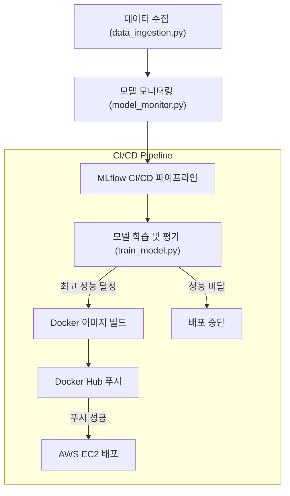

# **스팸 이메일 분류기 MLOps 파이프라인 구축**  
저희 프로젝트는 스팸 이메일 분류 모델을 개발하고, 그 모델이 항상 최상의 성능을 유지하도록 데이터 수집부터 배포까지 모든 과정을 완벽하게 자동화하는 것을 목표로 합니다.


- **프로젝트 기간:** 2025.07.28 ~ 2025.08.08  
- **배포 링크:** 서비스 바로가기 ([Docker Hub 링크](https://hub.docker.com/repository/docker/rladud9689/mlops-spam-classifier))
---


# 프로젝트 설명 간단 요약


### 전체적인 자동화 흐름

저희가 만든 MLOps 파이프라인은 사람의 개입 없이 GitHub Actions를 통해 자동으로 실행됩니다.

데이터 수집: 먼저 data_ingestion.py 스크립트가 대규모 데이터셋에서 새로운 데이터를 자동으로 샘플링합니다. (출처 캐글)

모델 모니터링: model_monitor.py가 기존 모델에 새 데이터를 적용해 성능이 기준치 아래로 떨어졌는지, 혹은 데이터의 분포가 변했는지(데이터 드리프트)를 감지합니다.

재학습 트리거: 만약 모델 성능이 저하되면, 자동으로 모델 재학습 파이프라인이 시작됩니다.

CI (지속적 통합): train_model.py가 새 데이터를 포함해 모델을 다시 학습시키고, MLflow를 사용해 성능을 추적합니다. 새로운 모델이 기존 최고 성능 모델보다 좋으면 다음 단계로 넘어갑니다.

CD (지속적 배포):
Docker를 사용해 FastAPI 기반의 API 서버를 이미지로 만들고, Docker Hub에 자동으로 푸시합니다.

그리고 GitHub Actions가 AWS EC2에 자동으로 접속해서, Docker Hub의 최신 이미지를 가져와 컨테이너를 실행시킵니다.

### 자동화의 핵심과 우리의 역할
저희 파이프라인의 핵심은 이 모든 과정이 main 브랜치에 코드를 푸시하는 순간부터 AWS 서버에 최신 모델이 배포되는 순간까지 사람의 개입 없이 완벽하게 자동화되었다는 점입니다.

### 따라서 저희가 이제부터 해야 할 일은 단 하나입니다.

모델이나 코드에 변경사항이 생겼을 때, main 브랜치에 푸시하는 것.

그 이후의 모든 과정은 GitHub Actions이 알아서 처리해주기 때문에, 저희는 오직 코드 개발에만 집중할 수 있습니다.

### 추가사항

### MLflow를 활용한 버전 관리

MLflow를 사용해 모델의 학습 결과를 모두 기록하고 관리했습니다.


### 조건부 배포

단순히 재학습된 모델을 무조건 배포하는 것이 아니라, MLflow Model Registry에 등록된 기존 최고 성능 모델과 새로 학습된 모델의 성능(F1-score 등)을 비교했습니다. 새로운 모델이 더 좋은 성능을 보일 때만 배포가 진행되도록 로직을 구현하여 모델의 성능이 떨어지는 것을 방지했습니다.

### Docker 컨테이너화

저희는 Dockerfile을 통해 개발 환경과 실행 환경을 완벽하게 분리했습니다. 이를 통해 어떤 서버에서도 동일한 환경에서 모델이 실행될 수 있도록 재현 가능성을 보장했습니다.

### Docker Compose

Docker Compose: 복잡한 컨테이너 실행 명령어를 docker-compose.yml 파일 하나로 통합하여, 배포 과정을 훨씬 단순화하고 효율적으로 만들었습니다.

### 데이터 품질 관리

저희는 단순히 모델 성능만 보는 것이 아니라, 새로운 데이터와 학습 데이터 간의 통계적 차이를 정기적으로 감지합니다. 이 데이터 드리프트를 통해 모델의 성능이 저하되기 전에 미리 재학습을 시작할 수 있는 예측 시스템을 구축했습니다.

### 서비스 안정성 확보

`docker-compose.yml` 파일에 **`restart: always`** 옵션을 설정하여, 어떤 이유로든 컨테이너가 중지될 경우 자동으로 재시작되도록 했습니다. 이를 통해 24시간 안정적인 서비스 운영이 가능합니다.


---


## **1. 서비스 구성 요소**  
### **1.1 주요 기능**  
- 데이터 드리프트 모니터링: 데이터의 통계적 변화를 주기적으로 감지하여 모델 재학습 필요 여부 판단

- 모델 재학습 자동화: 신규 데이터가 감지되면 GitHub Actions를 통해 모델 재학습 파이프라인 자동 트리거

- MLflow 기반 실험 추적: 모델 성능 지표(accuracy, f1-score 등) 및 파라미터를 자동 기록 및 비교

- MLflow 모델 레지스트리: 학습된 모델을 버전별로 관리하고, 배포할 모델을 체계적으로 선택

- 조건부 배포(Conditional Deployment): 신규 모델의 성능이 이전 모델보다 우수할 때만 Docker 이미지로 빌드 및 배포

- 컨테이너화: 모델을 Docker 이미지로 패키징하여 재현 가능한 배포 환경 구축

### **1.2 파이프라인 사용자 흐름**  
- 이 프로젝트는 사람의 개입 없이 GitHub Actions를 통해 아래와 같은 MLOps 파이프라인이 자동으로 실행됩니다.

### Monitor 잡 실행:

트리거: 메인 브랜치에 push가 발생하거나, 매일 자정에 자동으로 실행됩니다.

역할: src/model_monitor.py를 실행하여 새로운 데이터에 대한 모델 성능을 평가하고 데이터 드리프트 여부를 감지합니다.

결과: 재학습이 필요하다고 판단되면 retrain_needed 변수를 true로 설정하고 다음 단계(CI)를 트리거합니다.

### CI (지속적 통합) 잡 실행:

조건: Monitor 잡의 retrain_needed 변수가 true일 때만 실행됩니다.

역할: src/data_ingestion.py로 새로운 데이터를 가져오고, notebooks/train_model.py로 모델을 재학습합니다. MLflow를 이용해 모델 성능을 추적하고, 기존 최고 성능 모델과 비교합니다.

결과: 새로운 모델의 성능이 기존 모델보다 좋으면 deploy_needed 변수를 true로 설정하고 다음 단계(CD)를 트리거합니다.

### CD (지속적 배포) 잡 실행:

조건: CI 잡의 deploy_needed 변수가 true일 때만 실행됩니다.

역할: Dockerfile을 기반으로 FastAPI 서버와 새로운 모델이 포함된 Docker 이미지를 빌드합니다.

결과: 빌드된 Docker 이미지를 Docker Hub에 푸시하여 배포를 완료합니다.

### AWS 배포 잡 실행:

조건: CD 잡이 성공적으로 완료되면 자동으로 실행됩니다.

역할: SSH로 AWS EC2 인스턴스에 접속하여 최신 Docker 이미지를 가져오고, docker-compose로 컨테이너를 업데이트합니다.

결과: 최신 모델이 적용된 API 서버가 AWS EC2에서 실행됩니다.


---

## **2. 활용 장비 및 협업 툴**  

### **2.1 활용 장비**  
- **실행 환경:** *GitHub Actions (ubuntu-latest)*  
- **개발 환경:** *Visual Studio Code + Dev Containers (Python 3.10)*  
- **컨테이너 환경:** *Docker*  

### **2.2 협업 툴**  
- **소스 관리:** GitHub  
- **프로젝트 관리:** Notion  
- **커뮤니케이션:** Slack  
- **버전 관리:** Git  

---

## **3. 최종 선정 AI 모델 구조**  
- **모델 이름:** *Multinomial Naive Bayes*  
- **구조 및 설명:** *텍스트 분류에 효과적인 확률 기반의 모델입니다. 대용량 텍스트 데이터를 효율적으로 처리하며, TfidfVectorizer를 사용하여 텍스트 데이터를 벡터화한 후 학습을 진행합니다.*  
- **학습 데이터:** *Kaggle의 Spam Text Message Classification 데이터셋을 활용하여 시뮬레이션했습니다.*  
- **평가 지표:** *모델의 예측 성능을 평가하기 위해 다음 지표들을 사용했습니다.*  
정확도(Accuracy): 전체 예측 중 올바르게 예측한 비율.

정밀도(Precision): 스팸으로 예측한 것 중 실제 스팸의 비율.

재현율(Recall): 실제 스팸 중 스팸으로 올바르게 예측한 비율.

F1-Score: 정밀도와 재현율의 조화 평균.

---

## **4. 서비스 아키텍처**  
### **4.1 시스템 구조도**  
아래는 프로젝트의 전체적인 파이프라인을 나타내는 구조도입니다. 




### **4.2 데이터 흐름도**  
1. 데이터 수집: src/data_ingestion.py가 대규모 데이터셋(data/full_spam_dataset.csv)에서 새로운 데이터 100개를 샘플링하여 data/new_data/new_spam_data.csv에 저장합니다.

2. 데이터 처리: notebooks/train_model.py가 원본 데이터와 새로 수집된 데이터를 합친 후, 텍스트 전처리 및 TF-IDF 벡터화를 수행합니다.

3. 모델 학습: 처리된 데이터를 바탕으로 Multinomial Naive Bayes 모델을 학습합니다.

4. 모델 저장: 학습된 모델과 TfidfVectorizer는 models/ 디렉토리에 .joblib 파일로 저장됩니다.

5. 모델 서빙: API 서버(api/main.py)가 저장된 모델 파일을 로드하여 실시간 스팸 분류 예측에 사용합니다.

---

## **5. 사용 기술 스택**  
### **5.1 백엔드**  
- FastAPI: 스팸 분류 모델을 서빙하는 API 서버 구축

### **5.2 프론트엔드**  
-  

### **5.3 머신러닝 및 데이터 분석**  
- MLflow: 실험 추적, 모델 레지스트리 관리

- scikit-learn: Multinomial Naive Bayes 모델 학습 및 평가

- Pandas: 데이터 처리 및 분석

- NLTK: 텍스트 전처리 (토큰화, 어간 추출 등)

### **5.4 배포 및 운영**  
GitHub Actions: CI/CD 파이프라인 자동화

Docker Hub: 완성된 Docker 이미지를 저장하고 관리

Docker: 모델 컨테이너화 및 배포

Python: 백엔드 스크립트 및 모델 개발 

Git: 소스 코드 및 버전 관리

GitHub Actions: 모델 모니터링, 재학습, Docker 이미지 빌드, AWS 배포까지 모든 파이프라인을 자동화하는 데 사용

AWS EC2: 최종적으로 Docker 컨테이너를 배포하고 실행하는 클라우드 서버

---

## **6. 팀원 소개**  

| 이름      | 역할              | GitHub                               | 담당 기능                                 |
|----------|------------------|-------------------------------------|-----------------------------------------|
| **김시진** | 팀장 환경 및 서버 구축 | [https://github.com/kimsijin33]             |              |
| **김영** | 파이프라인 구축  | [https://github.com/kimyoung9689]             |              |
| **정예은** | 파이프라인 구축    | [https://github.com/wjddpdms03]             |          |
| **전수정** | 전처리,모델개발    | [https://github.com/pochacco0603]             |    |

---

## **7. Appendix**  
### **7.1 참고 자료**  
- 데이터 출처: Kaggle - Spam Text Message Classification

- MLOps 개념: MLflow Documentation 

### **7.2 설치 및 실행 방법**  
1. **프로젝트 복제(Clone):**  
    ```bash
    git clone https://github.com/AIBootcamp14/mlops-project-mlops-1.git

    cd mlops-project-mlops-1
    ```

2. **필요한 라이브러리 설치:**
   ```bash
    # 프로젝트에 필요한 모든 파이썬 패키지를 설치합니다.
    pip install -r requirements.txt
    ```

3. **MLflow UI 실행 (로컬 환경에서 확인):**  
    ```bash
    # 먼저 파이프라인을 한 번 실행해서 mlruns 폴더를 생성해야 합니다.
    # GitHub Actions에서 다운로드한 mlflow-artifacts 압축 해제 후, 아래 명령어를 실행하세요.
    python -m mlflow ui --backend-store-uri file:///your/local/path/to/mlflow-artifacts

    ```

4. **웹페이지 접속:**  
    ```
    http://127.0.0.1:5000
    ```


